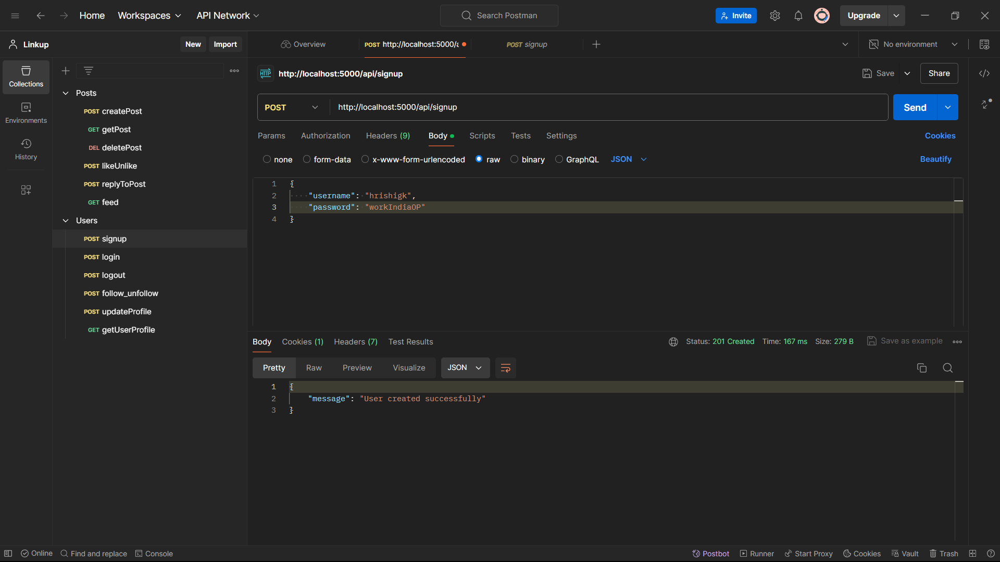
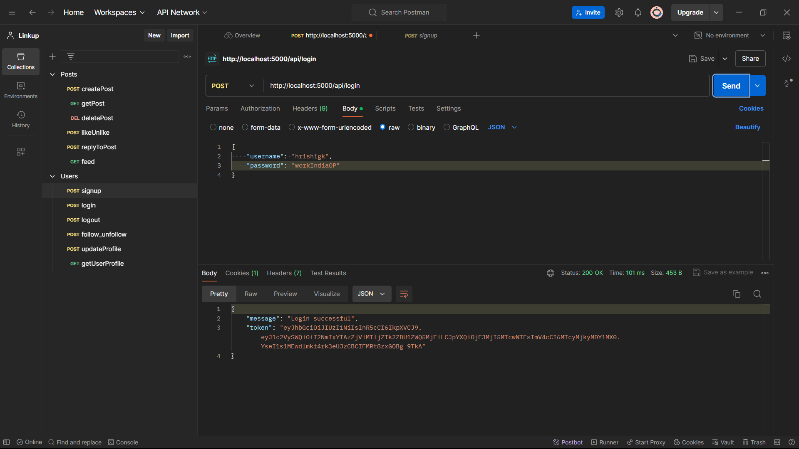
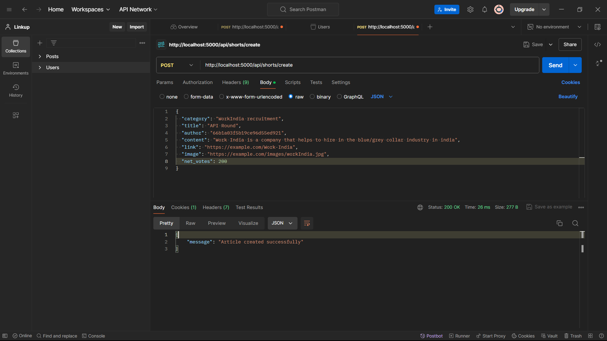
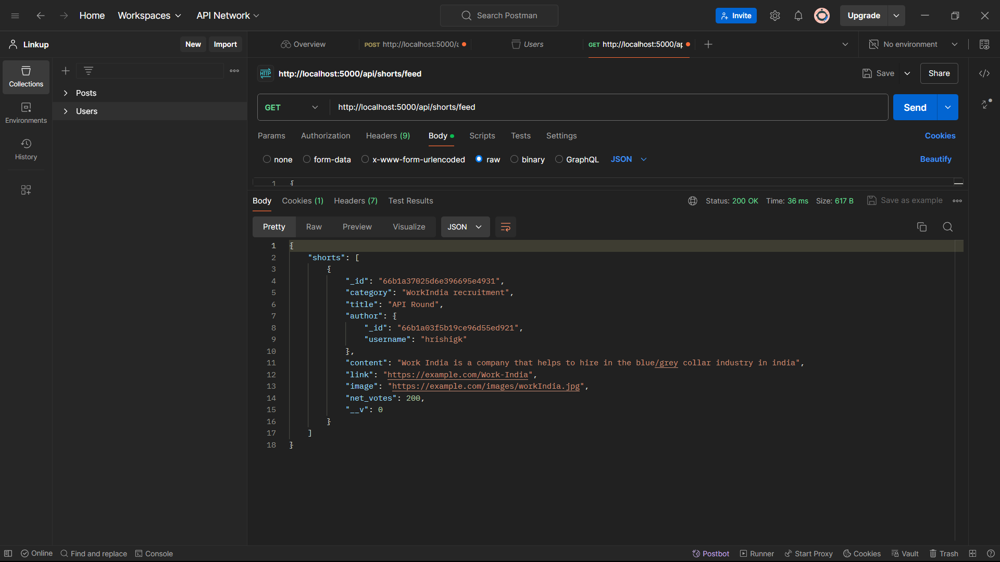
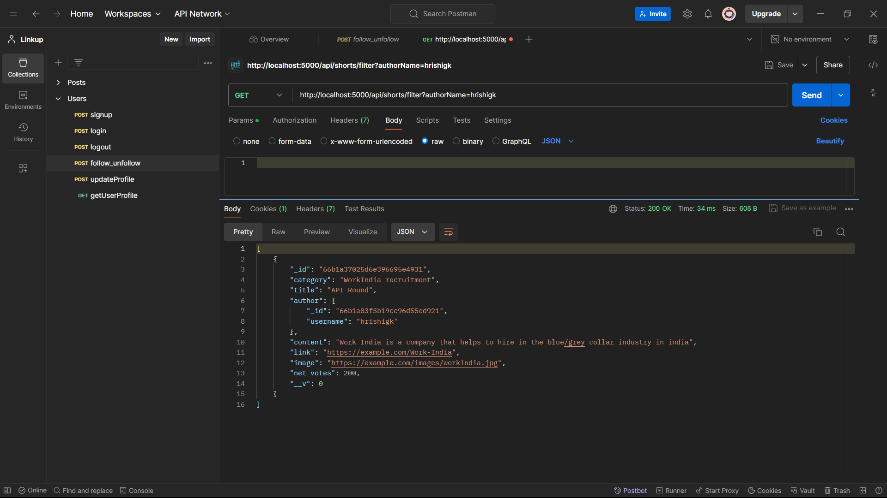
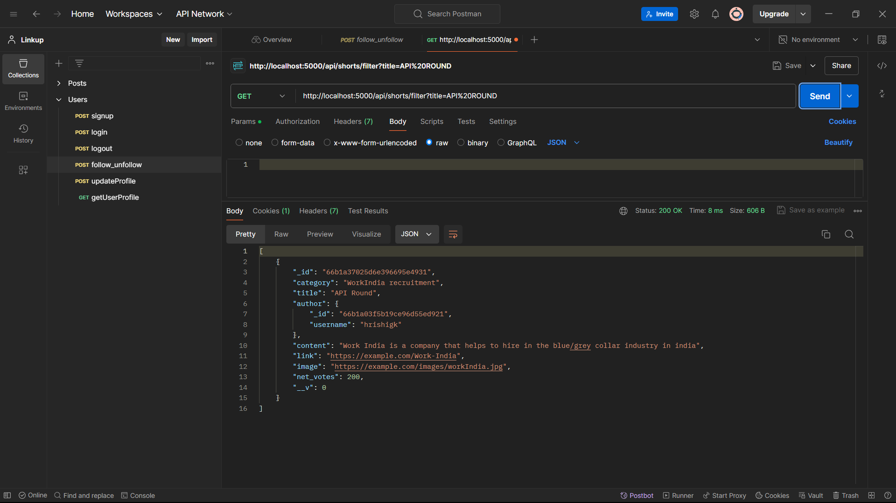

# OUTPUT IMAGES

# Node.js API with Express, Mongoose, JWT, and Bcrypt

This project is a Node.js API built using Express.js, Mongoose for MongoDB, JWT for authentication, and bcrypt for password hashing. It provides endpoints for user signup, login, and article management with filtering capabilities.

## Tech Stack

- **Node.js**: JavaScript runtime for server-side applications.
- **Express.js**: Fast and minimalist web framework for Node.js.
- **Mongoose**: ODM (Object Data Modeling) library for MongoDB and Node.js.
- **JWT (JSON Web Tokens)**: Securely transmits information between parties as a JSON object.
- **Bcrypt**: Library for hashing passwords to enhance security.

## Features

- User authentication (signup and login) with JWT.
- Password hashing with bcrypt.
- CRUD operations for articles.
- Filter articles by author or title.

## To run
- node app.js
- go to port 5000
- Outputs demonstrated on POSTMAN
